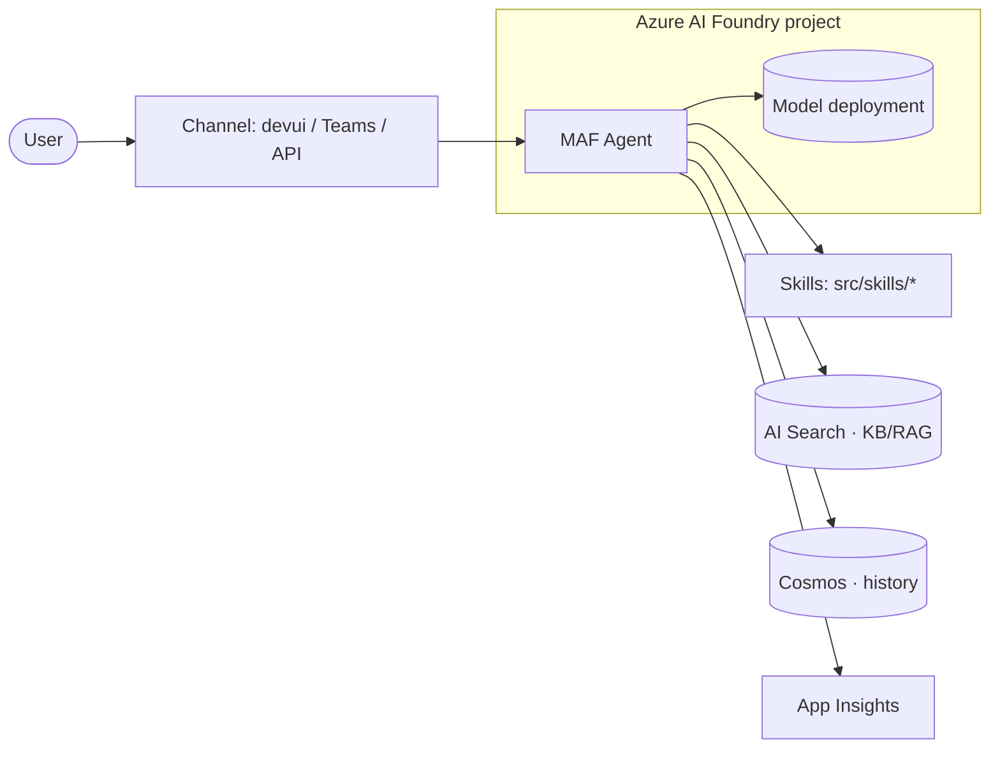
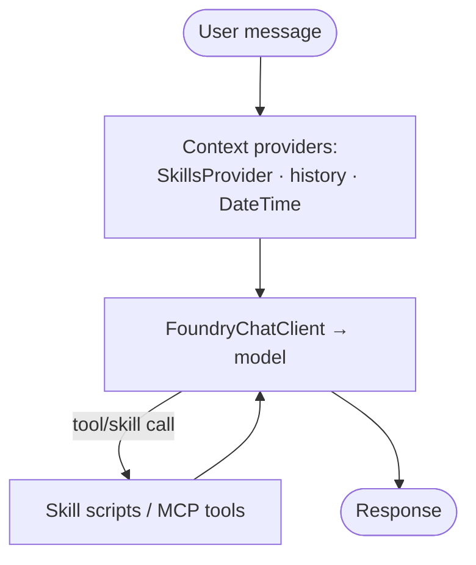

# Solution Architecture — design + diagram the agent

Turn the project spec into a clear architecture and **generate Mermaid diagrams into `src/docs/`**.

## Precondition

Read `references/context.md` first. If it doesn't exist or scope is unclear, stop and point the builder
to the `discovery` skill — architecture follows discovery, not the other way around.

## Design approach

Lay out the standard flow for a MAF + Foundry agent and adapt it to the spec:

```
channels (web/devui · Teams · API · voice)
  → agent (Microsoft Agent Framework: Agent + context providers + skills)
    → model (Foundry model deployment)
    → tools / skills (src/skills/<name>/ scripts, MCP tools)
    → Azure services (AI Search for KB/RAG · Cosmos for history · App Insights)
```

- Map each capability (§10/§11) to a skill or tool.
- Map each knowledge source (§12) to AI Search grounding (`AzureAISearchContextProvider`).
- Map state/memory (§23) to the history store (file for dev → Cosmos for prod).
- Show identity (§21): `DefaultAzureCredential` / managed identity.
- **Align to the Azure AI Landing Zone** — the agent runs *inside* the platform team's landing zone
  (networking, Foundry account/project, policies). Reflect that boundary in the diagram.

## Decide: single agent or multi-agent? (debate this with the builder)

Don't just accept the first shape — **advise like an architect and push back**. Default to the **simplest
thing that works**, and only add agents when the use case demands it.

- **Single agent + skills** (start here): one `Agent` with `SkillsProvider` + tools. Right for most cases —
  one coherent job, even with many skills. Simplest to build, test, and operate.
- **Multi-agent / workflow** (justify it): reach for this only when there are **distinct roles**, **parallel
  subtasks**, **hand-offs between specialists**, or **complex multi-step orchestration**. MAF supports:
  - `HandoffBuilder` — specialists hand off to each other (triage → expert).
  - `GroupChatBuilder` — agents collaborate/debate (round-robin or selector).
  - `ConcurrentBuilder` — fan out subtasks in parallel, then aggregate.
  - `MagenticBuilder` — a manager plans and coordinates specialists (Magentic-One pattern).
  - **Workflows** (graph) for explicit multi-step control flow; a workflow can be exposed *as an agent*.

State the trade-off plainly: more agents = more capability but more cost, latency, and failure modes. Ask
the builder what the work really looks like, recommend the leanest fit, and record the decision in §19.

## Output — Mermaid into `src/docs/architecture.md`

Generate **two** diagrams (Mermaid only — renders natively in VS Code / GitHub, easy to keep in sync):

**1. Solution architecture** — channels → agent → model → tools/skills → services.



**2. Agent internals** — how a turn flows through the agent.



Adapt both to the actual spec (drop services not used; add ones that are). Keep diagrams in sync with
`references/context.md` — when scope changes, update both. Record any architecture decisions back into
§19 of the spec.

## Output — the required-services list (feeds the platform step)

The design **decides which services the agent needs**. Write this list at the top of
`src/docs/architecture.md` (and mirror into §22 of the spec) — it's exactly what `environment-readiness`
turns into a request to the platform team.

- **Always** (every MAF + Foundry agent): Foundry project + chat model · Entra identity + RBAC ·
  Application Insights · container registry.
- **Design-driven** (include only if the design uses it): **Cosmos** (durable history/state) ·
  **AI Search** (RAG/KB grounding) · **Key Vault connection** (external-API secrets) · **MCP/data-source
  tools** (per integration).

Not every agent needs Cosmos or AI Search — list only what *this* design actually uses. Keep it tight.

## Hand off

Once the architecture **and its service list** are agreed, run `environment-readiness` to request/confirm
those services with the platform team (the last gate before coding), then `maf-app-authoring` to scaffold
`src/app.py`.
