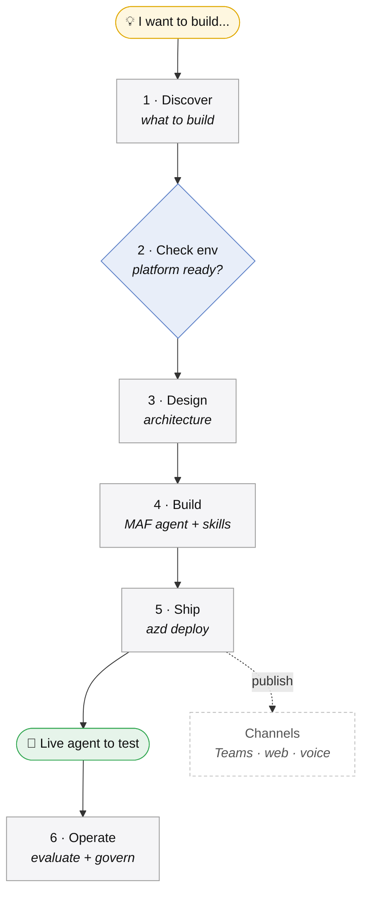
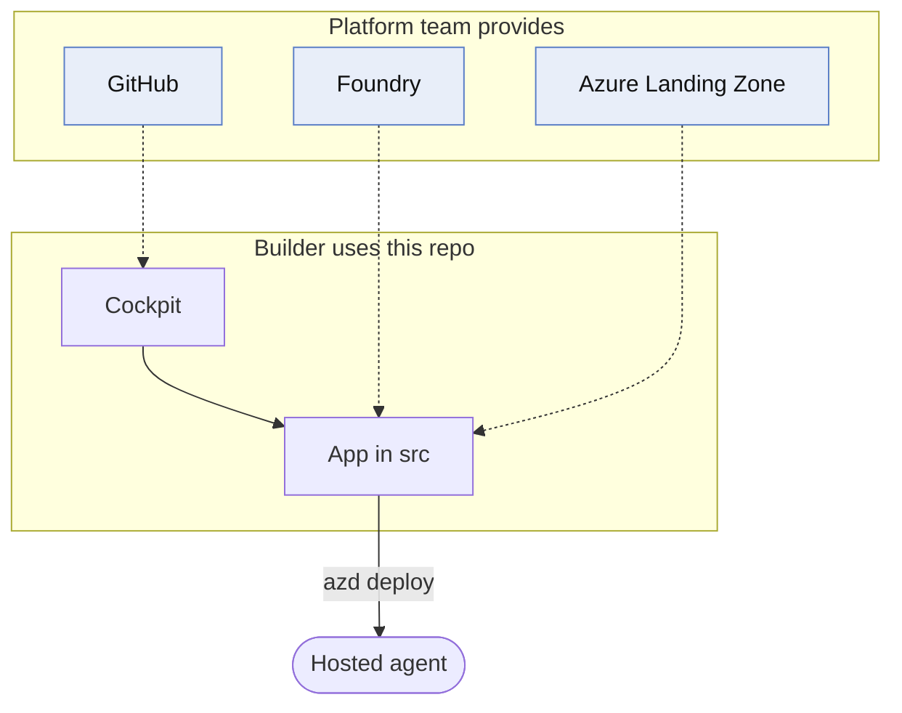

# agent-factory-starter

> A reusable starter kit — a **guided cockpit** that takes *anyone* (dev or non-dev) from
> **0 → a deployed, testable agentic AI app**, built with **Microsoft Agent Framework** (latest stable),
> **Microsoft Foundry** (hosted agent), **GitHub**, and **Microsoft Azure**.

This template is the **factory**. Each real project (e.g. `my-support-agent`) is an **instance** created from it.
You don't hand-write the app — you open the project in VS Code, talk to Copilot, and it guides you the
whole way: discover → design → build → deploy → test. Like Claude Code, for MAF+Foundry.

## The one-command vision

```bash
newagent my-agent    # scaffold the cockpit, git init, open in VS Code
```

Then just talk to Copilot — no Azure or coding expertise needed:

1. **Discover**  — “I want to build …” → Copilot interviews you, writes `references/context.md`
2. **Design**    — turns it into an architecture diagram
3. **Build**     — generates the MAF app in `src/` + skills
4. **Ship**      — deploy to Foundry from the command line → a URL you can test

## The journey (idea → live agent)

Each phase is driven by a cockpit skill that auto-loads when it's relevant — you just keep talking to Copilot.



> **Check env** (step 2) is a gate: the builder confirms the **platform team** has GitHub · Foundry · the
> Azure AI Landing Zone ready. The cockpit consumes that environment — it never provisions infrastructure.

## Two layers (this is the core idea)

| Layer | Path | What it is |
|-------|------|------------|
| **Cockpit (Agent A)** | repo root | How you *build*: `AGENTS.md`, `.github/` instructions + skills, `references/` context store |
| **App (Agent B)** | `src/` | What *ships*: the MAF app — **generated on-demand** by the cockpit skills. Azure infra is **platform-provided** (not in this repo) |

> The cockpit configures your coding assistant (Copilot/Claude) and **is the product**. The app is the
> deliverable it helps you build and run on Foundry.

**Who provides what** — the platform team provisions once; the builder consumes and ships:



## Planned structure

```
agent-factory-starter/
  AGENTS.md                       # always-on context + the “start here” journey (TEMPLATE w/ placeholders)
  .github/
    copilot-instructions.md       # points the agent at AGENTS.md
    instructions/                 # auto-applied coding rules (python)
    skills/                       # cockpit skills: discover → design → build → ship
  references/                     # context store (gitignored in real projects)
    README.md
    docs/                         # drop meeting notes / PDFs here
  src/                            # MAF app (Agent B) — GENERATED on-demand by the skills
    app.py · skills/ · docs/      #   (+ Dockerfile, azure.yaml, agent.yaml for deploy)
  scripts/
    newagent.sh                   # the one-command bootstrap
  .gitignore
```

> Azure infrastructure is **not** in this repo — the **platform team** provisions the Azure AI Landing
> Zone (Foundry, Cosmos, AI Search, identity). The app just deploys into it with `azd deploy`.

## Cockpit skills (`.github/skills/`)

The coding agent is driven by skills that auto-load by their `description`. Together they walk **anyone**
(dev or non-dev) the full journey — **idea → discover → design → build → deploy → a live app to test**:

| Phase | Skill | Produces |
|-------|-------|----------|
| Discover | `discovery` | `references/context.md` + filled `AGENTS.md` (conversational intake) |
| Check | `environment-readiness` | confirms GitHub · Foundry · Azure are ready (platform team provides them) |
| Design | `solution-architecture` | Mermaid diagrams in `src/docs/` |
| Build | `maf-app-authoring` | `src/app.py` (Agent + SkillsProvider + FoundryChatClient) |
| Build | `skill-authoring` | `src/skills/<name>/` capabilities |
| Integrate | `azure-integration` | Foundry · Cosmos · AI Search wiring |
| Verify | `infra-landing-zone` | confirms + pulls connection details from the platform-provided landing zone |
| Ship | `foundry-deploy` | Dockerfile + `agent.yaml` → manual `azd deploy` to a Foundry hosted agent |
| Surface | `channels` | publish to Teams · M365 Copilot · web · voice |
| Operate | `evaluation-observability` | eval quality (local → Foundry) + OpenTelemetry tracing |
| Govern | `governance` | responsible-AI guardrails + go-live sign-off |

> The cockpit **is** the product. `src/` is generated **on-demand** through these skills — this kit
> doesn't ship a hand-written app. **The platform team provisions** the environment (GitHub · Foundry ·
> Azure AI Landing Zone); the **builder consumes** it — the cockpit never provisions infrastructure.

## Stack (fixed)

- **Microsoft Agent Framework** — latest stable (`agent-framework-core`, `agent-framework-foundry`)
- **Microsoft Foundry** — hosted agent (Account + Project model), provisioned by the platform team
- **GitHub** — source control + versioning
- **Azure** — AI Landing Zone provisioned by the platform team; app uses `DefaultAzureCredential` + `azd deploy`
- **Python 3.13**, Ruff, async by default; **AG-UI** as the default UI, DevUI as the local debug harness

## Reference pattern

- Mirror the **Microsoft Agent Framework** samples for the MAF v1 hosted-agent pattern
  (the `agent-framework` repo: `python/samples`, `python/packages/foundry`).
- `src/app.py` shape: `Agent` + `SkillsProvider` (auto-discovers `skills/`) + `FoundryChatClient`
  + a `DateTimeContextProvider`, served via an **AG-UI** FastAPI endpoint (DevUI for quick local debugging).

## Status

🟢 Cockpit complete — 11 skills (discover → ship), `python` coding rules, `copilot-instructions.md`, and the
`newagent` bootstrap. Open a new project with `scripts/newagent.sh <name>`, then talk to Copilot.
